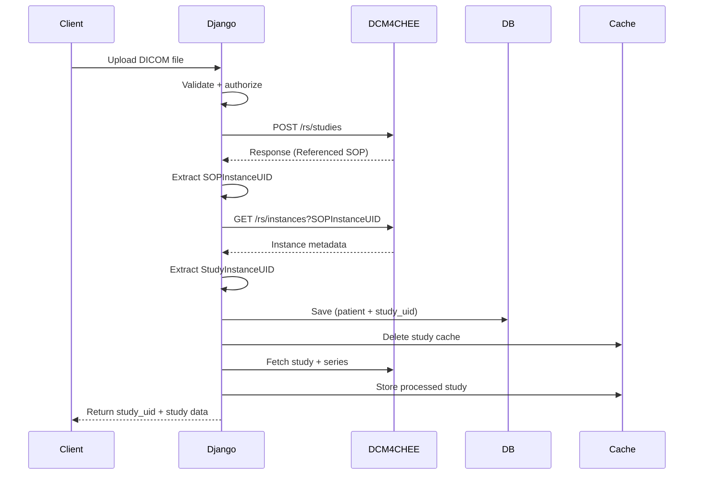

## 🧠 DICOM Upload Flow + Data Hierarchy

### 🔄 End-to-End Flow



---

### 🏗️ DICOM Hierarchy

```mermaid
graph TD
    Study[Study (StudyInstanceUID)]
    Series1[Series (SeriesInstanceUID)]
    Series2[Series (SeriesInstanceUID)]
    Instance1[Instance (SOPInstanceUID)]
    Instance2[Instance (SOPInstanceUID)]
    Instance3[Instance (SOPInstanceUID)]

    Study --> Series1
    Study --> Series2

    Series1 --> Instance1
    Series1 --> Instance2
    Series2 --> Instance3
```

---

### 🔑 Key Concept

```
A single uploaded DICOM file = Instance (SOPInstanceUID)

Instance → belongs to Series  
Series → belongs to Study  

Final goal → get StudyInstanceUID
```

---

### 📦 Example DCM4CHEE Upload Response (Simplified)

```json
{
  "00081199": {
    "Value": [
      {
        "00081155": {
          "Value": ["1.2.840.113619.2.55.3.604688..."]
        }
      }
    ]
  }
}
```

### 🔍 How your code extracts data

| Step       | Tag                   | Meaning                          |
| ---------- | --------------------- | -------------------------------- |
| `00081199` | ReferencedSOPSQ       | Contains reference sequence      |
| `00081155` | ReferencedInstanceUID | **SOPInstanceUID (Instance ID)** |

---

### 🔄 Instance → Study Resolution

After upload:

1. Extract instance UID:

```
SOPInstanceUID
```

2. Query PACS:

```
GET /rs/instances?SOPInstanceUID=<id>
```

3. Extract:

```
0020000D → StudyInstanceUID
```

---

### 📌 Important Note

```
POST /rs/studies does NOT return StudyInstanceUID directly.
It only returns a reference to the uploaded Instance.

StudyInstanceUID is resolved separately using /rs/instances.
```

---

### 🧠 Final Mental Model

```
Upload Instance
→ Get SOPInstanceUID
→ Query Instance Metadata
→ Extract StudyInstanceUID
→ Store + Cache + Return
```

---
